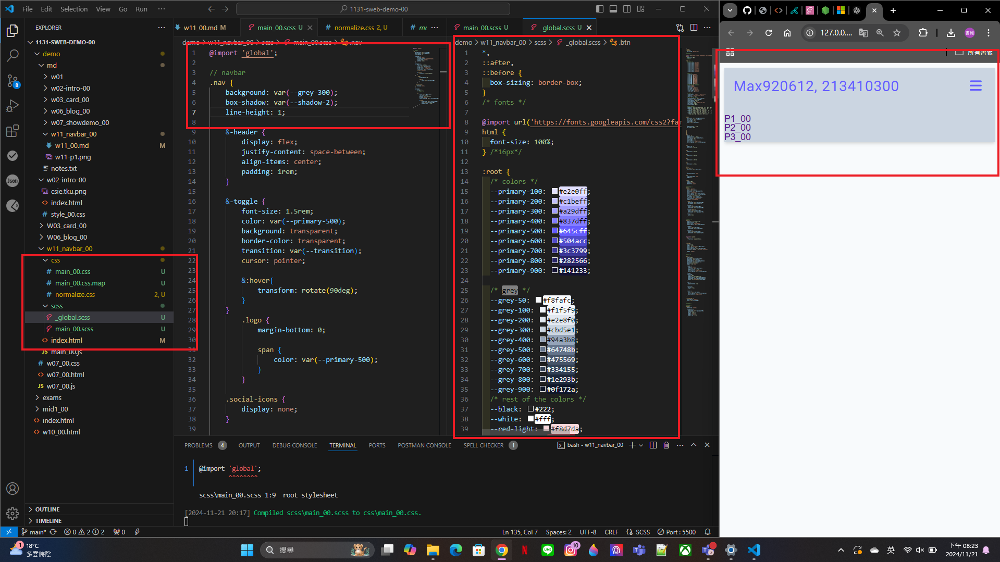
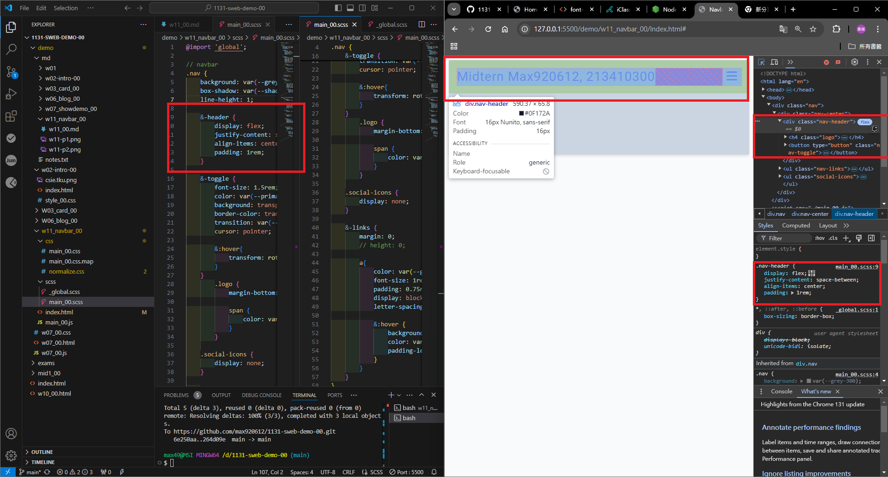

[My github URL](https://github.com/max920612/1131-sweb-demo-00)

[My Vercel URL](https://1131-sweb-demo-00.vercel.app/)

## W11-P1: Create html code for navbar
 

 
```
4015e22 max920612 Thu Nov 21 18:57:18 2024 +0800  W11-P1: Create html code for navbar
```

## W11-P2: Use sass to convert scss/main_xx.scss to css/main_xx.css



```
6ff74a6 max920612 Thu Nov 21 19:35:52 2024 +0800  W11-P2: Use sass to convert scss/main_xx.scss to css/main_xx.css
```

## W11-P3: scss for small screen
 

 
```
2cd6368 max920612 Thu Nov 21 20:23:02 2024 +0800  W11-P3: scss for small screen
```