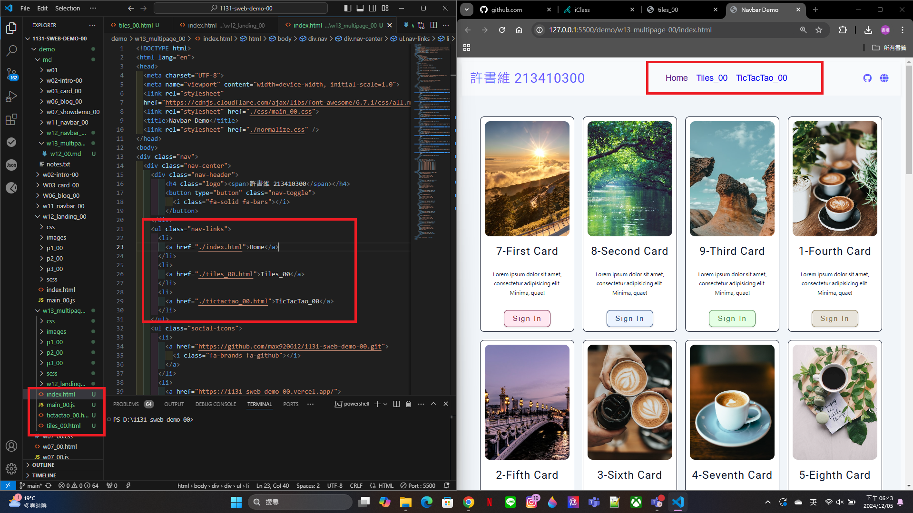
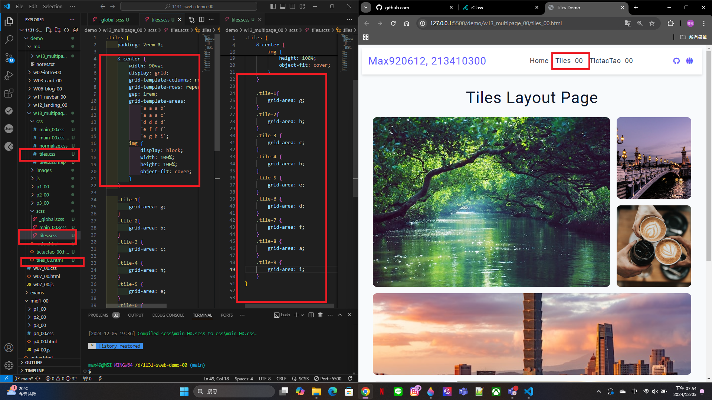
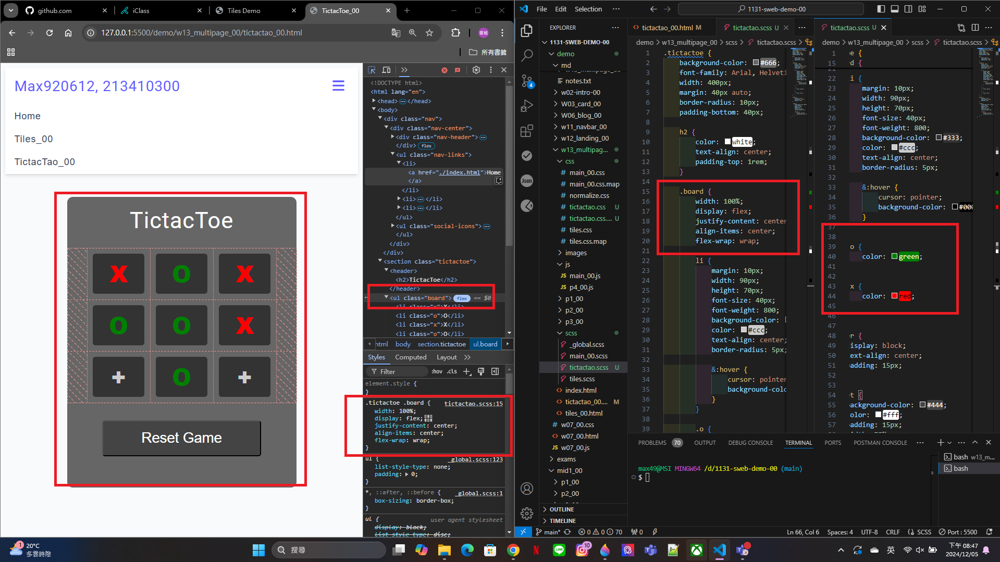

[My github URL](https://github.com/max920612/1131-sweb-demo-00)

[My Vercel URL](https://1131-sweb-demo-00.vercel.app/)

### W13-P1: Create tiles_xx.html and tictactoe_xx.htmml with the same navbar as in index.html



```
f3522f7 max920612 Thu Dec 5 18:40:03 2024 +0800   W13-P1: Create tiles_xx.html and tictactoe_xx.htmml with the same navbar as in index.html
```

### W13-P2: Make tiles_xx.html work using tiles_xx.scss



```
df0996b max920612 Thu Dec 5 19:25:10 2024 +0800   W13-P2: Make tiles_xx.html work using tiles_xx.scss
```

### W13-P3: Make tictactoe_xx.html work using tictactoe_xx.scss
 

 
```
805576d max920612 Thu Dec 5 20:49:25 2024 +0800   W13-P3: Make tictactoe_xx.html work using tictactoe_xx.scss
```