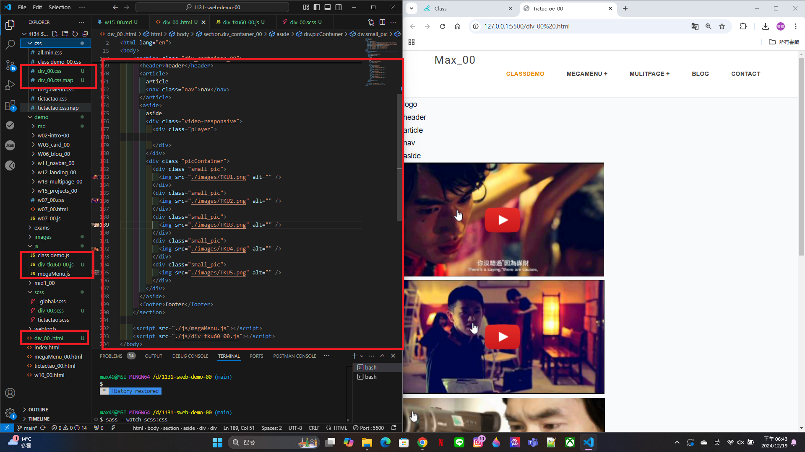
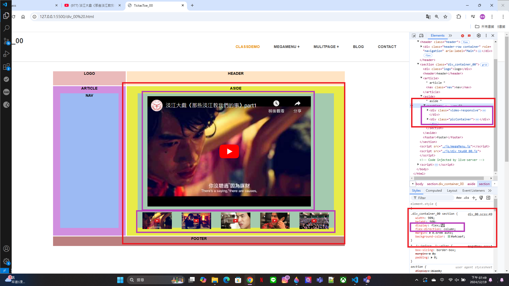
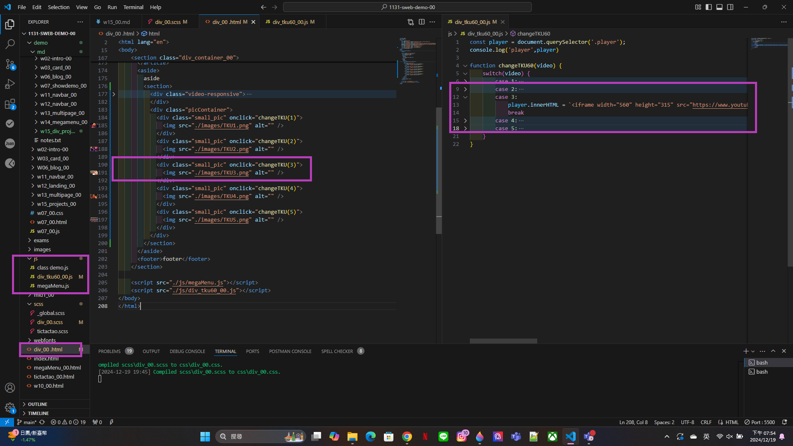
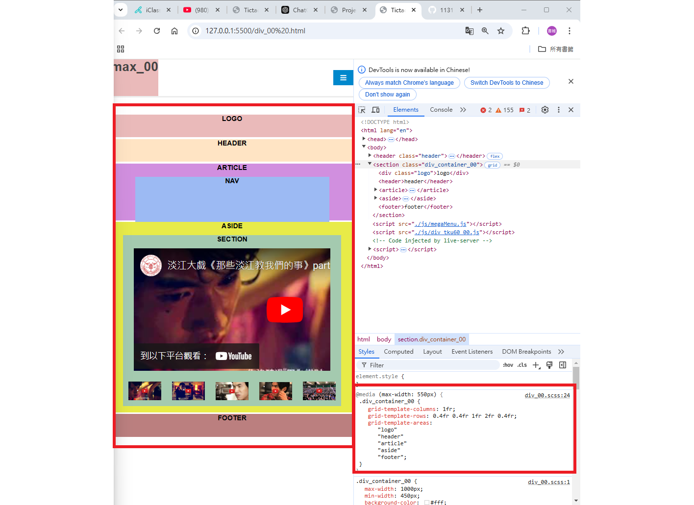
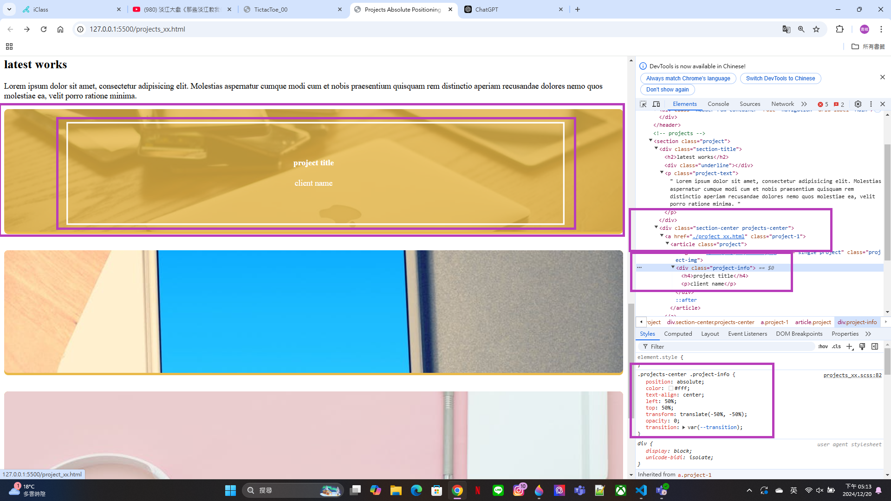
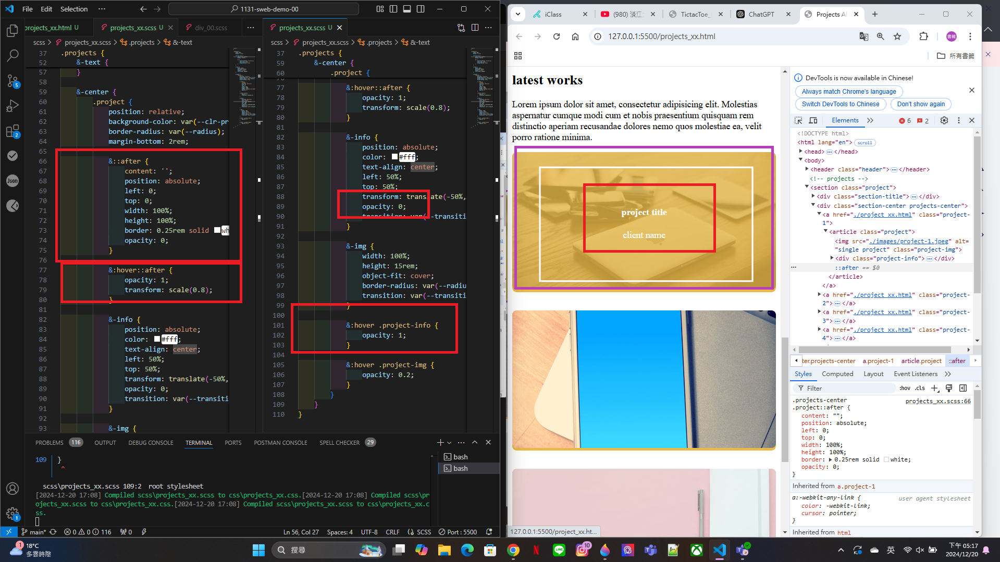

[My github URL](https://github.com/max920612/1131-sweb-demo-00)

[My Vercel URL](https://1131-sweb-demo-00.vercel.app/)

### W15-P1: Setup div_xx.html, div_xx.scss, div_tku60_xx.js
 

 
```
4d327d6 max920612 Thu Dec 19 18:46:13 2024 +0800  W15-P1: Setup div_xx.html, div_xx.scss, div_tku60_xx.js
```

W15-P2: Show div_xx.html correctly
 
#### => select tku60 pic 3, and show relevant youtube video
 

 
#### => html, and js code for showing video 3
 

 
```
e33e8ea max920612 Thu Dec 19 19:58:06 2024 +0800  W15-P2: Show div_xx.html correctly
```

W15-P3: make P2 div_xx.html responsive
 

 
```
58c72bb max920612 Thu Dec 19 20:18:56 2024 +0800  W15-P3: make P2 div_xx.html responsive
```
W15-P4: show absolute positioning in project_xx.html
 

 

 
```
e873b6d max920612 Thu Dec 19 21:09:25 2024 +0800  W15-P4: show absolute positioning in project_xx.html
```