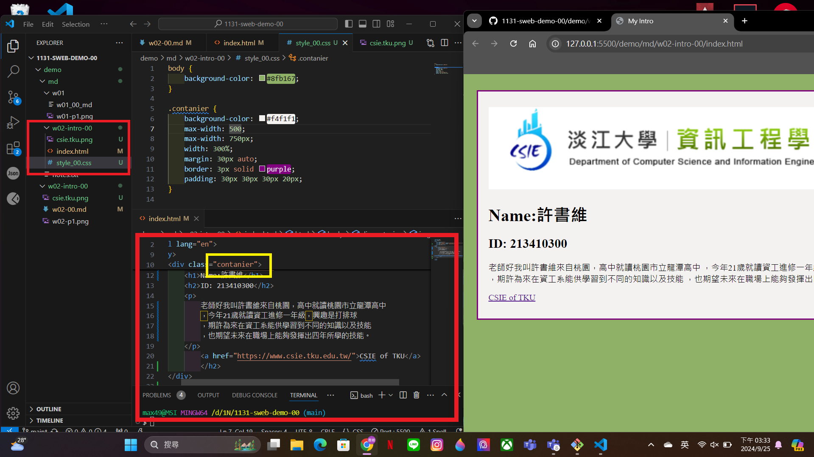

[My github URL
](https://github.com/max920612/1131-sweb-demo-00)

### w02-p1: Collaborrate your github repo to htchung@gms.tku.edu.tw and sian-0018 (TA)


```
faa9d21 htchung Thu Sep 19 18:58:01 2024 +0800  W02-P1: Collaborate your Github repo to htchung@gms.tku.edu.tw and sian-0018 (TA)
```

### W02-P2: My Introduction using html with css selector (container)



```
16f53cf max920612       Wed Sep 25 15:39:50 2024 +0800  W02-P2: My Introduction using html with css selector (container)
```

### w02p2-p3: git logs of w2

```
16f53cf max920612       Wed Sep 25 15:39:50 2024 +0800  W02-P2: My Introduction using html with css selector (container)
516f9ca max920612       Wed Sep 25 14:28:39 2024 +0800  w02-p1: Collaborrate your github repo to htchung@gms.tku.edu.tw and sian-0018 (TA)
```
